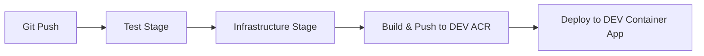
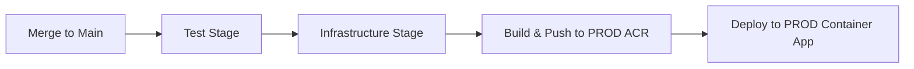

# 🔧 Azure DevOps Setup Guide - HSQ Forms API

## 🎯 Mål
Konfigurera Azure DevOps för att få igång första deployment och löpande CI/CD för HSQ Forms API.

## ⚠️ Nuvarande Status
- ✅ Pipeline konfigurerad
- ✅ Tests körs framgångsrikt 
- ❌ **ACR Login fails** - Service connections saknas
- ❌ Infrastructure deployment väntar

## 📋 Setup Steps

### 🔐 **STEG 1: Service Connections** (Kritiskt!)

#### 1.1 Azure Resource Manager Connections

**Gå till Azure DevOps:**
```
https://dev.azure.com/{din-organization}/{hsq-forms-api}/_settings/adminservices
```

**Skapa två service connections:**

##### DEV Environment
```yaml
Connection Type: Azure Resource Manager
Authentication: Service principal (automatic)
Connection Name: AzureServiceConnection-dev
Subscription: c0b03b12-570f-4442-b337-c9175ad4037f
Resource Group: rg-hsq-forms-dev
Grant access to all pipelines: ✓
```

##### PROD Environment  
```yaml
Connection Type: Azure Resource Manager
Authentication: Service principal (automatic)
Connection Name: AzureServiceConnection-prod
Subscription: HAZE-00B9-APP1066-PROD-Martech-SharedServices
Resource Group: rg-hsq-forms-prod
Grant access to all pipelines: ✓
```

#### 1.2 Container Registry Connections

**Skapa ACR service connections:**

##### DEV ACR
```yaml
Connection Type: Docker Registry
Registry Type: Azure Container Registry
Azure Subscription: (samma som ovan för DEV)
Azure Container Registry: hsqformsdevacr
Service Connection Name: hsqformsdevacr
Grant access to all pipelines: ✓
```

##### PROD ACR
```yaml
Connection Type: Docker Registry  
Registry Type: Azure Container Registry
Azure Subscription: (samma som ovan för PROD)
Azure Container Registry: hsqformsprodacr
Service Connection Name: hsqformsprodacr
Grant access to all pipelines: ✓
```

### 🔑 **STEG 2: Pipeline Variables**

**Gå till Pipeline Settings:**
```
https://dev.azure.com/{organization}/{project}/_build?definitionId={pipeline-id}&_a=summary
```

**Lägg till Variables:**
```yaml
# Secrets (Lock icon = enabled)
DB_ADMIN_PASSWORD: {stark-lösenord-för-postgresql}

# Optional
FRONTEND_URL: https://husqvarnagroup.com,https://forms.husqvarnagroup.com
```

**Generera säkert lösenord:**
```bash
# Kör detta för att få ett säkert lösenord
openssl rand -base64 32
```

### 🏗️ **STEG 3: Azure Resource Groups** (Skapas automatiskt)

Pipeline skapar dessa resource groups automatiskt:
```bash
# DEV
Resource Group: rg-hsq-forms-dev
Location: West Europe
Subscription: c0b03b12-570f-4442-b337-c9175ad4037f

# PROD  
Resource Group: rg-hsq-forms-prod
Location: West Europe
Subscription: HAZE-00B9-APP1066-PROD-Martech-SharedServices
```

### 🚀 **STEG 4: Trigger First Deployment**

Efter service connections är konfigurerade:

```bash
# Option A: Manual pipeline run
# Gå till Azure DevOps pipeline och klicka "Run pipeline"

# Option B: Git push (rekommenderat)
git add .
git commit -m "deploy: trigger first deployment after service connections setup"
git push origin develop
```

## 📊 **Expected Pipeline Flow**

### Develop Branch (DEV deployment)


### Main Branch (PROD deployment)


## 🔍 **Pipeline Stages Breakdown**

### 1. Test Stage (✅ Already working)
```yaml
Duration: ~55 seconds
Actions:
  - Install Python dependencies
  - Run pytest tests
  - Validate code quality
```

### 2. Infrastructure Stage (⏳ Will work after service connections)
```yaml
Duration: ~3-5 minutes (first time)
Actions:
  - Create resource group
  - Deploy Bicep template
  - Setup PostgreSQL, Storage, Container Apps Environment
```

### 3. Build & Push Stage (⏳ Will work after ACR connections)
```yaml
Duration: ~2-3 minutes
Actions:
  - Build Docker image
  - Push to Azure Container Registry
  - Tag with build ID and latest
```

### 4. Deploy Stage (⏳ Will work after infrastructure exists)
```yaml
Duration: ~1-2 minutes
Actions:
  - Update Container App with new image
  - Apply environment variables
  - Health check
```

## 🎉 **Success Indicators**

### Pipeline Success
```bash
✅ Test stage: PASSED
✅ Infrastructure stage: PASSED (resources created)
✅ Build stage: PASSED (image pushed to ACR)
✅ Deploy stage: PASSED (container app updated)
```

### DEV Environment Ready
```bash
# API Health Check
curl https://{container-app-url}/health
# Expected: {"status": "healthy"}

# API Documentation (DEV only)
curl https://{container-app-url}/docs
# Expected: HTML documentation page

# Templates endpoint
curl https://{container-app-url}/api/templates
# Expected: [] (empty array initially)
```

## 🔧 **After First Deployment**

### 1. Get Container App URL
```bash
# I Azure Portal eller via CLI
az containerapp list --resource-group rg-hsq-forms-dev --query "[].properties.configuration.ingress.fqdn"
```

### 2. Test API Endpoints
```bash
# Health check
curl https://{fqdn}/health

# List templates (empty initially)
curl https://{fqdn}/api/templates

# Test rate limiting
curl -X POST https://{fqdn}/api/templates \
  -H "Content-Type: application/json" \
  -d '{"name":"test","description":"test"}'
```

### 3. Monitor Deployment
```bash
# Azure Portal
1. Container Apps → hsq-forms-api-dev-{token}
2. Application Insights → Request telemetry
3. Log Analytics → Container logs
```

## 🔄 **Ongoing Development Workflow**

### Daily Development
```bash
# 1. Make changes
git checkout develop
# ... edit files ...

# 2. Test locally
python3 test_security_config.py

# 3. Deploy to DEV
git add .
git commit -m "feat: add new functionality"
git push origin develop
# → Automatic deployment to DEV

# 4. Test in DEV environment
curl https://{dev-url}/api/...

# 5. Production deployment
git checkout main
git merge develop
git push origin main
# → Automatic deployment to PROD
```

### Feature Branch Workflow (Recommended)
```bash
# Create feature branch
git checkout -b feature/new-endpoint
# ... implement feature ...
git push origin feature/new-endpoint

# Create PR to develop → triggers DEV deployment
# Create PR to main → triggers PROD deployment
```

## ⚡ **Quick Start Checklist**

- [ ] **Service Connections**: Create AzureServiceConnection-dev & AzureServiceConnection-prod
- [ ] **ACR Connections**: Create hsqformsdevacr & hsqformsprodacr connections
- [ ] **Pipeline Variables**: Add DB_ADMIN_PASSWORD (secret)
- [ ] **Trigger Pipeline**: Push to develop branch
- [ ] **Verify DEV**: Test API endpoints
- [ ] **Production Deploy**: Merge to main branch

**⏱️ Total Setup Time**: 15-30 minutes

**🎯 Next Action**: Start with Step 1 - Service Connections in Azure DevOps!
