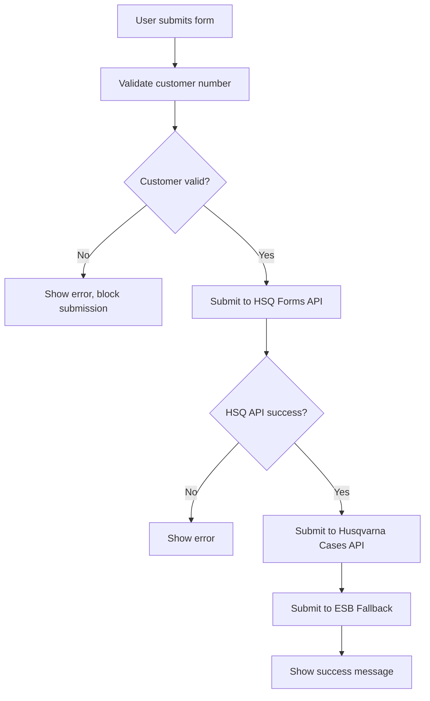

# B2B Support Form - Husqvarna Group API Integration

## Översikt

B2B Support-formuläret har integrerats med Husqvarna Group's specifika API (`https://api-qa.integration.husqvarnagroup.com`) för att hantera kundvalidering och ärendehantering med dual submission-funktionalitet.

## Funktionalitet

### 1. Customer Number Validation
- **Primär**: Husqvarna Group API `/accounts` endpoint för kundvalidering
- **Fallback**: ESB API för kundvalidering
- **Sista utväg**: Lokal formatvalidering (regex: `^[A-Z0-9]{3,20}$`)

### 2. Dual Submission Architecture
1. **HSQ Forms API**: Sparar formulärdata i lokal databas (primär)
2. **Husqvarna Group Cases API**: Skickar ärendedata till `/cases` endpoint (komplement)
3. **ESB Fallback**: Används om Husqvarna Group API är otillgänglig

### 3. Real-time Customer Validation
- Validering sker automatiskt när användaren skriver kundnummer (800ms debounce)
- Visar tydlig feedback om kundnummer är giltigt/ogiltigt
- Blockerar formulärinlämning om kundvalidering misslyckats

## API Endpoints

### Husqvarna Group API
- **Base URL**: `https://api-qa.integration.husqvarnagroup.com/hqw170/v1`
- **Customer Validation**: `GET /accounts?customerNumber={num}&customerCode=DOJ`
- **Case Creation**: `POST /cases`

### HSQ Forms API
- **Template Submission**: `POST /api/templates/{templateId}/submit`
- **File Upload**: `POST /api/files/upload/{submissionId}`

### ESB Fallback
- **Customer Validation**: `POST https://api.hsqforms.se/esb/validate-customer`
- **Case Submission**: `POST https://api.hsqforms.se/esb/b2b-support`

## Miljövariabler

```env
VITE_API_URL=http://host.docker.internal:8000/api
VITE_HUSQVARNA_API_BASE_URL=https://api-qa.integration.husqvarnagroup.com/hqw170/v1
VITE_HUSQVARNA_API_KEY=your-husqvarna-group-api-key-here
```

## Formulärfält

### Obligatoriska fält
- Support Type (technical/customer)
- Customer Number
- Email
- Company Name
- Contact Person
- Subject
- Problem Description
- Urgency (low/medium/high)

### Teknisk support (tilläggsvalidering)
- PNC Number eller Serial Number (minst ett krävs)

### Valfria fält
- Phone
- File Attachments

## Submission Flow



## Error Handling

### Customer Validation Errors
- Husqvarna Group API unavailable → Fall back to ESB validation
- ESB validation unavailable → Fall back to local format validation
- Invalid format → Show specific error message

### Submission Errors
- HSQ Forms API failure → Stop submission, show error
- Husqvarna Cases API failure → Continue (non-critical), log warning
- ESB failure → Continue (non-critical), log warning

## Testing

### Manual Testing
1. Start the development server:
   ```bash
   cd /Users/emilkarlsson/Documents/Dev/hsq-forms-api/forms/hsq-forms-container-b2b-support
   npm run dev
   ```

2. Test customer validation with different numbers:
   - Valid: `TEST123`, `VALID456`
   - Invalid: `AB` (too short), `invalid@#$` (invalid chars)

### Automated Testing
Run the integration test script:
```bash
node test-api-integration.js
```

## File Structure

```
src/
├── components/
│   └── B2BSupportForm.tsx    # Main form component with API integration
├── i18n.ts                   # Internationalization setup
└── main.tsx                  # App entry point

Configuration:
├── .env                      # Environment variables
├── package.json              # Dependencies
└── vite.config.ts           # Build configuration
```

## Key Implementation Details

### Customer Validation Function
```typescript
const validateCustomer = async (customerNum: string) => {
  // 1. Try Husqvarna Group API
  // 2. Fall back to ESB API
  // 3. Final fallback to local validation
}
```

### Dual Submission Pattern
```typescript
const onSubmit = async (data: FormData) => {
  // 1. Submit to HSQ Forms API (critical)
  // 2. Submit to Husqvarna Cases API (complementary)
  // 3. Submit to ESB (fallback)
}
```

### Error Recovery
- Network errors don't block the primary submission
- External API failures are logged but don't break user experience
- Fallback mechanisms ensure form always works

## Production Considerations

1. **API Keys**: Replace test API key with production key
2. **URLs**: Update to production Husqvarna Group API URL
3. **Monitoring**: Add logging for API call success/failure rates
4. **Rate Limiting**: Consider implementing request throttling
5. **Caching**: Cache customer validations for better performance

## Support

For technical issues or questions about the integration:
1. Check browser console for detailed error logs
2. Verify API keys and URLs in environment variables
3. Test individual API endpoints using the test script
4. Review network requests in browser developer tools
